# ARIA Multi-Agent System - Mermaid Diagrams

Complete visual documentation of the ARIA architecture broken into digestible sections.

---

## Diagram 1: High-Level System Overview

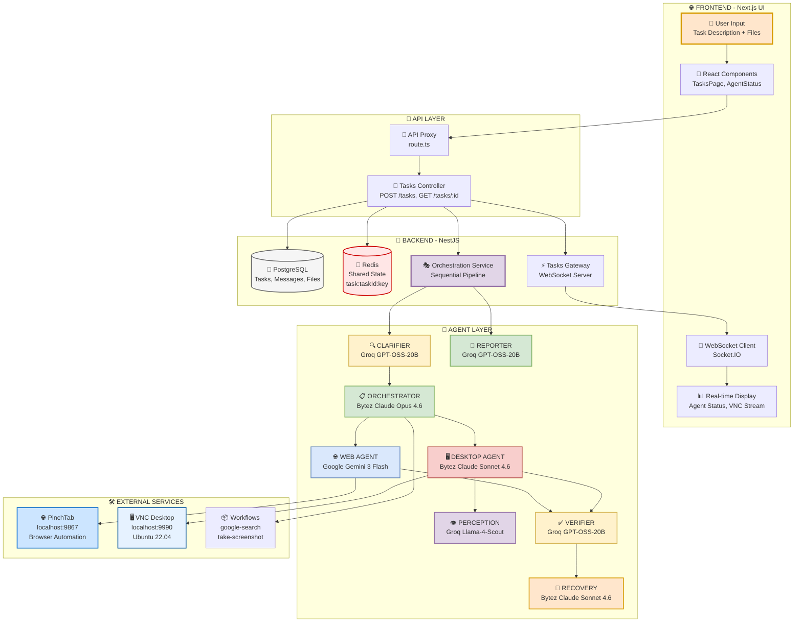

**Legend:**
- 🟡 Yellow: Input/Clarification
- 🟢 Green: Planning/Orchestration
- 🔵 Blue: Web Actions
- 🔴 Red: Desktop Actions
- 🟣 Purple: Analysis/Perception
- 🟠 Orange: Recovery/Reporting

---

## Diagram 2: Frontend to Backend Flow

```mermaid
sequenceDiagram
    participant U as 👤 User
    participant UI as 📱 React UI<br/>(TasksPage)
    participant WS as 🔌 WebSocket<br/>(useWebSocket)
    participant API as 🚪 API Proxy<br/>(route.ts)
    participant TC as 🎯 TasksController<br/>(POST /tasks)
    participant TS as 📦 TasksService<br/>(create)
    participant DB as 💾 PostgreSQL<br/>(Prisma)
    participant Redis as 🔴 Redis<br/>(Shared State)
    participant GW as ⚡ TasksGateway<br/>(WebSocket)
    participant OS as 🎭 OrchestrationService<br/>(run)
    
    rect rgb(255, 230, 204)
    Note over U,UI: USER INPUT PHASE
    U->>UI: Enter task description<br/>"Search Google for Python courses"
    U->>UI: Optional: Attach files (base64)
    U->>UI: Click Submit
    end
    
    rect rgb(230, 242, 255)
    Note over UI,API: API REQUEST PHASE
    UI->>API: POST /api/proxy/tasks<br/>{description, files, model}
    API->>TC: Forward to backend<br/>localhost:3001/tasks
    end
    
    rect rgb(213, 232, 212)
    Note over TC,DB: TASK CREATION PHASE
    TC->>TS: create(createTaskDto)
    TS->>DB: Create task record<br/>status: PENDING
    DB-->>TS: Task created<br/>taskId: "abc123"
    TS->>DB: Save files (if any)<br/>base64 → database
    TS->>DB: Create system message<br/>"Task created"
    end
    
    rect rgb(255, 230, 230)
    Note over TS,Redis: STATE INITIALIZATION
    TS->>Redis: Publish event<br/>aria:tasks:pending
    TS->>Redis: Initialize state<br/>task:abc123:status = "pending"
    end
    
    rect rgb(225, 213, 231)
    Note over GW,WS: WEBSOCKET NOTIFICATION
    GW->>WS: Emit task_created<br/>{id, status, description}
    WS->>UI: Update task list<br/>Show new task
    end
    
    rect rgb(255, 242, 204)
    Note over OS: ORCHESTRATION STARTS
    TS->>OS: run(userInput, taskId)
    Note over OS: Sequential pipeline begins<br/>CLARIFIER → ORCHESTRATOR → AGENTS
    end
    
    rect rgb(230, 255, 230)
    Note over UI: FRONTEND DISPLAY
    UI->>U: Show task in list<br/>Status: PENDING
    UI->>U: Connect to WebSocket<br/>Join task room
    UI->>U: Display: "Starting task..."
    end
    
    style U fill:#FFE6CC,stroke:#D79B00,stroke-width:3px
    style UI fill:#E1F5FE,stroke:#0277BD,stroke-width:2px
    style WS fill:#B3E5FC,stroke:#0288D1,stroke-width:2px
    style TC fill:#C8E6C9,stroke:#388E3C,stroke-width:2px
    style TS fill:#A5D6A7,stroke:#2E7D32,stroke-width:2px
    style DB fill:#F5F5F5,stroke:#666666,stroke-width:2px
    style Redis fill:#FFCDD2,stroke:#C62828,stroke-width:2px
    style GW fill:#CE93D8,stroke:#7B1FA2,stroke-width:2px
    style OS fill:#E1BEE7,stroke:#6A1B9A,stroke-width:3px
```

**Key Points:**
- User input flows through React UI → API Proxy → Backend
- Task created in PostgreSQL with PENDING status
- Redis initialized for shared state
- WebSocket notifies frontend immediately
- OrchestrationService starts sequential pipeline

---

## Diagram 3: Phase 1 - CLARIFIER Agent

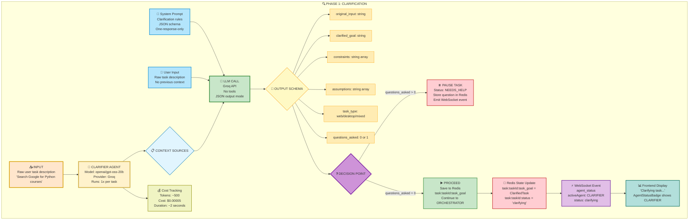

**CLARIFIER Details:**

**Input Example:**
```json
{
  "userInput": "Search Google for Python courses, save top 3 to file, email me"
}
```

**Output Example:**
```json
{
  "original_input": "Search Google for Python courses, save top 3 to file, email me",
  "clarified_goal": "Search Google for 'Python courses', extract top 3 result titles, save to desktop file 'python_courses.txt', then email the file to user",
  "constraints": ["Must use Google search", "File must be on desktop", "Email must include file attachment"],
  "assumptions": ["User email is known", "Desktop has write permissions"],
  "task_type": "mixed",
  "questions_asked": 0
}
```

**If Clarification Needed:**
```json
{
  "clarified_goal": "REQUIRES_USER_CLARIFICATION: Which email address should I send the results to?",
  "questions_asked": 1
}
```

---

## Diagram 4: Phase 2 - ORCHESTRATOR Agent (Planning)

```mermaid
graph TB
    subgraph "📋 PHASE 2: PLANNING"
        A[📥 INPUT<br/>ClarifiedTask from CLARIFIER<br/>clarified_goal, task_type, constraints]
        
        B[🤖 ORCHESTRATOR AGENT<br/>Model: anthropic/claude-opus-4.6<br/>Provider: Bytez<br/>Runs: 2-3x per task<br/>User-selectable model]
        
        C{📋 CONTEXT SOURCES}
        C1[📄 System Prompt<br/>1261 lines<br/>Planning rules<br/>Workflow integration<br/>Step granularity]
        C2[🎯 Clarified Goal<br/>From shared state<br/>task:taskId:task_goal]
        C3[📦 Available Workflows<br/>Via tool calls<br/>list_workflows<br/>read_workflow]
        
        D{🔧 TOOLS AVAILABLE}
        D1[🔍 list_workflows<br/>Returns all workflows<br/>name, description, variables]
        D2[📖 read_workflow<br/>Get workflow metadata<br/>timeout, required vars]
        D3[✅ use_workflow<br/>Include in plan<br/>workflow_name, variables]
        
        E[🔄 LLM CALL 1<br/>Workflow Discovery<br/>Bytez API<br/>Tools enabled]
        
        F[📞 Tool Execution<br/>WorkflowService<br/>List/Read workflows]
        
        G[🔄 LLM CALL 2<br/>Final Planning<br/>With tool results<br/>JSON output]
        
        H{🎯 OUTPUT SCHEMA}
        H1[steps: ExecutionStep array]
        H2[estimated_duration_minutes: number]
        H3[complexity: simple/moderate/complex]
        
        I{📝 ExecutionStep Schema}
        I1[id: step_1, step_2...]
        I2[type: web/desktop/workflow]
        I3[description: what to do]
        I4[success_criteria: how to verify]
        I5[context: extra info]
        I6[depends_on: prerequisite steps]
        I7[workflow_name: if type=workflow]
        I8[workflow_vars: if type=workflow]
        
        J[🔴 Redis State Update<br/>task:taskId:execution_plan<br/>Store complete plan]
        
        K[⚡ WebSocket Event<br/>agent_status<br/>activeAgent: ORCHESTRATOR<br/>status: planning]
        
        L[📊 Frontend Display<br/>'Creating execution plan...'<br/>AgentStatusBadge shows ORCHESTRATOR]
        
        M[💰 Cost Tracking<br/>Tokens: ~3000<br/>Cost: $0.135<br/>Duration: ~15 seconds]
        
        N[✅ VALIDATION<br/>steps.length > 0<br/>Each step has type<br/>Success criteria defined]
    end
    
    A --> B
    B --> C
    C --> C1 & C2 & C3
    C --> D
    D --> D1 & D2 & D3
    D --> E
    E --> F
    F --> G
    G --> H
    H --> H1 & H2 & H3
    H1 --> I
    I --> I1 & I2 & I3 & I4 & I5 & I6 & I7 & I8
    I --> N
    N --> J
    J --> K
    K --> L
    B --> M
    
    style A fill:#FFE6CC,stroke:#D79B00,stroke-width:3px
    style B fill:#D5E8D4,stroke:#82B366,stroke-width:4px
    style C fill:#E1F5FE,stroke:#0277BD,stroke-width:2px
    style C1 fill:#B3E5FC,stroke:#0288D1,stroke-width:2px
    style C2 fill:#B3E5FC,stroke:#0288D1,stroke-width:2px
    style C3 fill:#B3E5FC,stroke:#0288D1,stroke-width:2px
    style D fill:#FFF9C4,stroke:#F9A825,stroke-width:2px
    style D1 fill:#FFECB3,stroke:#FFA000,stroke-width:2px
    style D2 fill:#FFECB3,stroke:#FFA000,stroke-width:2px
    style D3 fill:#FFECB3,stroke:#FFA000,stroke-width:2px
    style E fill:#C8E6C9,stroke:#388E3C,stroke-width:3px
    style F fill:#A5D6A7,stroke:#2E7D32,stroke-width:2px
    style G fill:#C8E6C9,stroke:#388E3C,stroke-width:3px
    style H fill:#FFF9C4,stroke:#F9A825,stroke-width:2px
    style H1 fill:#FFECB3,stroke:#FFA000,stroke-width:1px
    style H2 fill:#FFECB3,stroke:#FFA000,stroke-width:1px
    style H3 fill:#FFECB3,stroke:#FFA000,stroke-width:1px
    style I fill:#E1BEE7,stroke:#6A1B9A,stroke-width:2px
    style I1 fill:#CE93D8,stroke:#7B1FA2,stroke-width:1px
    style I2 fill:#CE93D8,stroke:#7B1FA2,stroke-width:1px
    style I3 fill:#CE93D8,stroke:#7B1FA2,stroke-width:1px
    style I4 fill:#CE93D8,stroke:#7B1FA2,stroke-width:1px
    style I5 fill:#CE93D8,stroke:#7B1FA2,stroke-width:1px
    style I6 fill:#CE93D8,stroke:#7B1FA2,stroke-width:1px
    style I7 fill:#CE93D8,stroke:#7B1FA2,stroke-width:1px
    style I8 fill:#CE93D8,stroke:#7B1FA2,stroke-width:1px
    style J fill:#FFCDD2,stroke:#C62828,stroke-width:2px
    style K fill:#E1BEE7,stroke:#6A1B9A,stroke-width:2px
    style L fill:#B2DFDB,stroke:#00695C,stroke-width:2px
    style M fill:#F0F4C3,stroke:#9E9D24,stroke-width:2px
    style N fill:#C8E6C9,stroke:#388E3C,stroke-width:2px
```

**ORCHESTRATOR Output Example:**
```json
{
  "steps": [
    {
      "id": "step_1",
      "type": "workflow",
      "description": "Search Google for Python courses",
      "success_criteria": "Search results returned with at least 3 results",
      "workflow_name": "google-search",
      "workflow_vars": {"query": "Python courses"}
    },
    {
      "id": "step_2",
      "type": "desktop",
      "description": "Create file python_courses.txt on desktop",
      "success_criteria": "File exists with 3 course titles",
      "context": "Use terminal command",
      "depends_on": ["step_1"]
    },
    {
      "id": "step_3",
      "type": "web",
      "description": "Navigate to Gmail compose",
      "success_criteria": "Compose window visible",
      "context": "Use pinchtab_navigate"
    }
  ],
  "estimated_duration_minutes": 3,
  "complexity": "moderate"
}
```

---

## Diagram 5: Phase 3 - DESKTOP AGENT Execution

```mermaid
graph TB
    subgraph "🖥️ PHASE 3A: DESKTOP AGENT EXECUTION"
        A[📥 INPUT<br/>ExecutionStep<br/>type: desktop<br/>description, success_criteria]
        
        B[🤖 DESKTOP AGENT<br/>Model: anthropic/claude-sonnet-4.6<br/>Provider: Bytez<br/>User-selectable<br/>Max 20 iterations]
        
        C{📋 CONTEXT SOURCES}
        C1[📄 System Prompt<br/>Desktop control instructions<br/>Computer tool schema<br/>VNC connection details]
        C2[📋 Execution Plan Step<br/>Current step details<br/>Success criteria<br/>Context hints]
        C3[📜 Action History<br/>From shared state<br/>Previous actions<br/>What worked/failed]
        C4[🖼️ Screenshot + PERCEPTION<br/>Current desktop state<br/>UI analysis<br/>Clickable elements]
        C5[🔄 Recovery Strategy<br/>If escalated<br/>Alternative approaches<br/>What to avoid]
        
        D[🔄 ITERATION LOOP<br/>Max 20 iterations<br/>Budget per step: ~5]
        
        E[📸 Take Screenshot<br/>VNC localhost:9990<br/>Base64 image]
        
        F[👁️ PERCEPTION AGENT<br/>Analyze screenshot<br/>Extract UI state<br/>Find clickable elements]
        
        G[📝 Build Decision Prompt<br/>Step + Perception + History<br/>Recovery strategy<br/>Plan context]
        
        H[🔧 LLM CALL<br/>Bytez/Groq API<br/>Tools enabled<br/>Screenshot attached]
        
        I{🎯 TOOLS AVAILABLE}
        I1[🖱️ computer<br/>action: click<br/>x, y coordinates]
        I2[⌨️ computer<br/>action: type<br/>text character-by-character]
        I3[📋 computer<br/>action: paste<br/>text via clipboard FAST]
        I4[🔑 computer<br/>action: key<br/>Return, ctrl+c, Escape]
        I5[📜 computer<br/>action: scroll<br/>direction, amount]
        I6[📸 computer<br/>action: screenshot<br/>capture desktop]
        I7[🚀 computer<br/>action: application<br/>chromium, terminal, vscode]
        I8[💻 computer<br/>action: terminal_command<br/>shell command execution]
        I9[✅ set_task_status<br/>status: completed/failed<br/>message: description]
        
        J[⚙️ Execute Tool Call<br/>VNC API<br/>Perform action<br/>Wait 1s to settle]
        
        K{🔍 Check Success}
        
        L[✅ Step Complete<br/>Success criteria met<br/>Exit iteration loop]
        
        M[🔄 Continue Loop<br/>Next iteration<br/>Take new screenshot]
        
        N[⚠️ Max Iterations<br/>Force completion<br/>or escalate]
        
        O[🔴 Redis State Update<br/>task:taskId:action_history<br/>Append action result]
        
        P[⚡ WebSocket Event<br/>agent_activity<br/>type: action<br/>screenshot, details]
        
        Q[📊 Frontend Display<br/>'Executing step X of Y...'<br/>VNC stream visible<br/>Action log updates]
        
        R[💰 Cost Tracking<br/>Tokens: ~2500/iteration<br/>Cost: ~$0.0225/iteration<br/>PERCEPTION: +tokens]
    end
    
    A --> B
    B --> C
    C --> C1 & C2 & C3 & C4 & C5
    C --> D
    D --> E
    E --> F
    F --> G
    G --> H
    H --> I
    I --> I1 & I2 & I3 & I4 & I5 & I6 & I7 & I8 & I9
    I --> J
    J --> K
    K -->|Success criteria met| L
    K -->|Not complete| M
    M --> E
    D -->|Iteration > 20| N
    L --> O
    O --> P
    P --> Q
    B --> R
    
    style A fill:#FFE6CC,stroke:#D79B00,stroke-width:3px
    style B fill:#F8CECC,stroke:#B85450,stroke-width:4px
    style C fill:#E1F5FE,stroke:#0277BD,stroke-width:2px
    style C1 fill:#B3E5FC,stroke:#0288D1,stroke-width:2px
    style C2 fill:#B3E5FC,stroke:#0288D1,stroke-width:2px
    style C3 fill:#B3E5FC,stroke:#0288D1,stroke-width:2px
    style C4 fill:#B3E5FC,stroke:#0288D1,stroke-width:2px
    style C5 fill:#B3E5FC,stroke:#0288D1,stroke-width:2px
    style D fill:#E1BEE7,stroke:#6A1B9A,stroke-width:3px
    style E fill:#FFECB3,stroke:#FFA000,stroke-width:2px
    style F fill:#CE93D8,stroke:#7B1FA2,stroke-width:2px
    style G fill:#C8E6C9,stroke:#388E3C,stroke-width:2px
    style H fill:#A5D6A7,stroke:#2E7D32,stroke-width:3px
    style I fill:#FFF9C4,stroke:#F9A825,stroke-width:2px
    style I1 fill:#FFECB3,stroke:#FFA000,stroke-width:1px
    style I2 fill:#FFECB3,stroke:#FFA000,stroke-width:1px
    style I3 fill:#FFECB3,stroke:#FFA000,stroke-width:1px
    style I4 fill:#FFECB3,stroke:#FFA000,stroke-width:1px
    style I5 fill:#FFECB3,stroke:#FFA000,stroke-width:1px
    style I6 fill:#FFECB3,stroke:#FFA000,stroke-width:1px
    style I7 fill:#FFECB3,stroke:#FFA000,stroke-width:1px
    style I8 fill:#FFECB3,stroke:#FFA000,stroke-width:1px
    style I9 fill:#FFECB3,stroke:#FFA000,stroke-width:1px
    style J fill:#FFE082,stroke:#F57C00,stroke-width:2px
    style K fill:#CE93D8,stroke:#7B1FA2,stroke-width:3px
    style L fill:#C8E6C9,stroke:#388E3C,stroke-width:2px
    style M fill:#FFE082,stroke:#F57C00,stroke-width:2px
    style N fill:#FFCDD2,stroke:#C62828,stroke-width:2px
    style O fill:#FFCDD2,stroke:#C62828,stroke-width:2px
    style P fill:#E1BEE7,stroke:#6A1B9A,stroke-width:2px
    style Q fill:#B2DFDB,stroke:#00695C,stroke-width:2px
    style R fill:#F0F4C3,stroke:#9E9D24,stroke-width:2px
```

**DESKTOP AGENT Tool Call Examples:**

**Click:**
```json
{"name": "computer", "arguments": {"action": "click", "x": 500, "y": 300}}
```

**Paste Text (Preferred):**
```json
{"name": "computer", "arguments": {"action": "paste", "text": "Hello World"}}
```

**Key Combination:**
```json
{"name": "computer", "arguments": {"action": "key", "key": "ctrl+c"}}
```

**Terminal Command:**
```json
{"name": "computer", "arguments": {"action": "terminal_command", "command": "echo 'test' > ~/Desktop/file.txt"}}
```

**Mark Complete:**
```json
{"name": "set_task_status", "arguments": {"status": "completed", "message": "File created successfully"}}
```

---

## Diagram 6: Phase 3 - WEB AGENT Execution

```mermaid
graph TB
    subgraph "🌐 PHASE 3B: WEB AGENT EXECUTION"
        A[📥 INPUT<br/>ExecutionStep<br/>type: web<br/>description, success_criteria]
        
        B[🤖 WEB AGENT<br/>Model: gemini-3-flash-preview<br/>Provider: Google<br/>Max 20 iterations<br/>Loops 15-20x per task]
        
        C[🚀 EAGER INITIALIZATION<br/>Browser launched immediately<br/>Instance metadata ready<br/>Prevents duplicate launches]
        
        D{📋 CONTEXT SOURCES}
        D1[📄 System Prompt<br/>PinchTab instructions<br/>Browser metadata<br/>Tool schemas]
        D2[📋 Execution Plan Step<br/>Current step details<br/>Success criteria<br/>Context hints]
        D3[📜 Action History<br/>From shared state<br/>Previous web actions<br/>What worked]
        D4[📸 Page Snapshot<br/>Interactive elements<br/>Refs e1, e2, e3...<br/>Structured DOM]
        D5[👁️ PERCEPTION Analysis<br/>Every 2 iterations<br/>Page state<br/>UI elements]
        D6[🌐 Browser Metadata<br/>Instance ID<br/>Current tab<br/>URL, title]
        
        E[🔄 ITERATION LOOP<br/>Max 20 iterations<br/>Budget per step: ~5]
        
        F[📸 Get Page Snapshot<br/>PinchTab API<br/>localhost:9867<br/>Interactive elements with refs]
        
        G[👁️ PERCEPTION AGENT<br/>Every 2 iterations<br/>Analyze page state<br/>Extract UI info]
        
        H[✅ Auto-Completion Check<br/>Evaluate success criteria<br/>Against snapshot<br/>60% term match]
        
        I[📝 Build Decision Prompt<br/>Step + Snapshot + Perception<br/>Plan context<br/>Browser metadata]
        
        J[🔧 LLM CALL<br/>Google Gemini API<br/>Tools enabled<br/>Snapshot data]
        
        K{🎯 TOOLS AVAILABLE}
        K1[🌐 pinchtab_navigate<br/>url: string<br/>Navigate to URL]
        K2[📸 pinchtab_get_snapshot<br/>Returns elements<br/>with refs]
        K3[🖱️ pinchtab_click<br/>ref: string<br/>Click element]
        K4[⌨️ pinchtab_type<br/>ref: string<br/>text: string]
        K5[🔑 pinchtab_press<br/>key: Enter/Tab/Escape<br/>Keyboard input]
        K6[⏳ pinchtab_wait<br/>ms: number<br/>Max 5000ms]
        K7[📜 pinchtab_scroll<br/>direction: up/down<br/>amount: number]
        K8[✅ pinchtab_mark_complete<br/>message: string<br/>Mark step done]
        
        L[⚙️ Execute Tool Call<br/>PinchTab API<br/>Perform action<br/>Wait 1s to settle]
        
        M{🔍 Check Success}
        
        N[✅ Step Complete<br/>Success criteria met<br/>or marked complete<br/>Exit loop]
        
        O[🔄 Continue Loop<br/>Next iteration<br/>Get new snapshot]
        
        P[⚠️ Max Iterations<br/>Force completion<br/>Prevent infinite loops]
        
        Q[🔴 Redis State Update<br/>task:taskId:action_history<br/>task:taskId:downloaded_files]
        
        R[⚡ WebSocket Event<br/>agent_activity<br/>type: action<br/>url, elements]
        
        S[📊 Frontend Display<br/>'Navigating to...'<br/>'Filling form...'<br/>Action log updates]
        
        T[💰 Cost Tracking<br/>Tokens: ~1800/iteration<br/>Cost: ~$0.0018/iteration<br/>PERCEPTION: +tokens]
    end
    
    A --> B
    B --> C
    C --> D
    D --> D1 & D2 & D3 & D4 & D5 & D6
    D --> E
    E --> F
    F --> G
    G --> H
    H --> I
    I --> J
    J --> K
    K --> K1 & K2 & K3 & K4 & K5 & K6 & K7 & K8
    K --> L
    L --> M
    M -->|Success or complete| N
    M -->|Not complete| O
    O --> F
    E -->|Iteration > 20| P
    N --> Q
    Q --> R
    R --> S
    B --> T
    
    style A fill:#FFE6CC,stroke:#D79B00,stroke-width:3px
    style B fill:#DAE8FC,stroke:#6C8EBF,stroke-width:4px
    style C fill:#B3E5FC,stroke:#0288D1,stroke-width:3px
    style D fill:#E1F5FE,stroke:#0277BD,stroke-width:2px
    style D1 fill:#B3E5FC,stroke:#0288D1,stroke-width:2px
    style D2 fill:#B3E5FC,stroke:#0288D1,stroke-width:2px
    style D3 fill:#B3E5FC,stroke:#0288D1,stroke-width:2px
    style D4 fill:#B3E5FC,stroke:#0288D1,stroke-width:2px
    style D5 fill:#B3E5FC,stroke:#0288D1,stroke-width:2px
    style D6 fill:#B3E5FC,stroke:#0288D1,stroke-width:2px
    style E fill:#E1BEE7,stroke:#6A1B9A,stroke-width:3px
    style F fill:#FFECB3,stroke:#FFA000,stroke-width:2px
    style G fill:#CE93D8,stroke:#7B1FA2,stroke-width:2px
    style H fill:#C8E6C9,stroke:#388E3C,stroke-width:2px
    style I fill:#A5D6A7,stroke:#2E7D32,stroke-width:2px
    style J fill:#81C784,stroke:#2E7D32,stroke-width:3px
    style K fill:#FFF9C4,stroke:#F9A825,stroke-width:2px
    style K1 fill:#FFECB3,stroke:#FFA000,stroke-width:1px
    style K2 fill:#FFECB3,stroke:#FFA000,stroke-width:1px
    style K3 fill:#FFECB3,stroke:#FFA000,stroke-width:1px
    style K4 fill:#FFECB3,stroke:#FFA000,stroke-width:1px
    style K5 fill:#FFECB3,stroke:#FFA000,stroke-width:1px
    style K6 fill:#FFECB3,stroke:#FFA000,stroke-width:1px
    style K7 fill:#FFECB3,stroke:#FFA000,stroke-width:1px
    style K8 fill:#FFECB3,stroke:#FFA000,stroke-width:1px
    style L fill:#FFE082,stroke:#F57C00,stroke-width:2px
    style M fill:#CE93D8,stroke:#7B1FA2,stroke-width:3px
    style N fill:#C8E6C9,stroke:#388E3C,stroke-width:2px
    style O fill:#FFE082,stroke:#F57C00,stroke-width:2px
    style P fill:#FFCDD2,stroke:#C62828,stroke-width:2px
    style Q fill:#FFCDD2,stroke:#C62828,stroke-width:2px
    style R fill:#E1BEE7,stroke:#6A1B9A,stroke-width:2px
    style S fill:#B2DFDB,stroke:#00695C,stroke-width:2px
    style T fill:#F0F4C3,stroke:#9E9D24,stroke-width:2px
```

**WEB AGENT Tool Call Examples:**

**Navigate:**
```json
{"name": "pinchtab_navigate", "arguments": {"url": "https://mail.google.com"}}
```

**Get Snapshot:**
```json
{"name": "pinchtab_get_snapshot", "arguments": {}}
// Returns: {elements: [{ref: "e1", tag: "input", text: "Search"}]}
```

**Click Element:**
```json
{"name": "pinchtab_click", "arguments": {"ref": "e1"}}
```

**Type Text:**
```json
{"name": "pinchtab_type", "arguments": {"ref": "e1", "text": "Python courses"}}
```

**Press Key:**
```json
{"name": "pinchtab_press", "arguments": {"key": "Enter"}}
```

**Mark Complete:**
```json
{"name": "pinchtab_mark_complete", "arguments": {"message": "Gmail compose window loaded"}}
```

---

## Diagram 7: Phase 3 - WORKFLOW Execution

```mermaid
graph TB
    subgraph "📦 PHASE 3C: WORKFLOW EXECUTION"
        A[📥 INPUT<br/>ExecutionStep<br/>type: workflow<br/>workflow_name, workflow_vars]
        
        B[🔧 WORKFLOW SERVICE<br/>Not an LLM agent<br/>Pre-built automation<br/>Deterministic execution]
        
        C[📂 Load Workflow<br/>From workflows/ directory<br/>google-search.workflow.ts<br/>take-screenshot.workflow.ts]
        
        D{📋 WORKFLOW METADATA}
        D1[name: string<br/>google-search]
        D2[description: string<br/>Search Google and return results]
        D3[version: string<br/>1.0.0]
        D4[timeout_ms: number<br/>30000 30 seconds]
        D5[variables: array<br/>query: string, required]
        
        E[✅ Validate Variables<br/>Check required vars<br/>Type validation<br/>Schema match]
        
        F{🛠️ SERVICES AVAILABLE}
        F1[🌐 PinchTab Service<br/>Browser automation<br/>navigate, click, type<br/>snapshot, wait]
        F2[🖥️ Desktop Service<br/>Future: VNC control<br/>Not yet implemented<br/>for workflows]
        
        G[⏱️ Execute with Timeout<br/>Race condition<br/>Workflow vs timeout<br/>Max 30s default]
        
        H[🔄 WORKFLOW STEPS<br/>Sequential execution<br/>Each step uses services<br/>No LLM calls]
        
        I[📝 Example: google-search<br/>1. Navigate to Google<br/>2. Get snapshot find search box<br/>3. Click search box<br/>4. Type query<br/>5. Press Enter<br/>6. Wait for results<br/>7. Extract top 10 headings]
        
        J{🎯 WORKFLOW OUTPUT}
        J1[success: boolean<br/>true/false]
        J2[message: string<br/>Completion message]
        J3[data: object<br/>Workflow-specific results]
        J4[error: string<br/>If failed]
        
        K[🔴 Redis State Update<br/>task:taskId:action_history<br/>Append workflow result]
        
        L[⚡ WebSocket Event<br/>agent_activity<br/>type: workflow<br/>name, result]
        
        M[📊 Frontend Display<br/>'Executing workflow: Google Search...'<br/>Progress updates]
        
        N[💰 Cost Tracking<br/>Tokens: 0<br/>Cost: $0<br/>No LLM calls<br/>Pure automation]
        
        O[⏱️ Duration Tracking<br/>Typical: 10-30 seconds<br/>Depends on workflow<br/>Network latency]
    end
    
    A --> B
    B --> C
    C --> D
    D --> D1 & D2 & D3 & D4 & D5
    D --> E
    E --> F
    F --> F1 & F2
    F --> G
    G --> H
    H --> I
    I --> J
    J --> J1 & J2 & J3 & J4
    J --> K
    K --> L
    L --> M
    B --> N
    B --> O
    
    style A fill:#FFE6CC,stroke:#D79B00,stroke-width:3px
    style B fill:#E1D5E7,stroke:#9673A6,stroke-width:4px
    style C fill:#D5E8D4,stroke:#82B366,stroke-width:2px
    style D fill:#FFF9C4,stroke:#F9A825,stroke-width:2px
    style D1 fill:#FFECB3,stroke:#FFA000,stroke-width:1px
    style D2 fill:#FFECB3,stroke:#FFA000,stroke-width:1px
    style D3 fill:#FFECB3,stroke:#FFA000,stroke-width:1px
    style D4 fill:#FFECB3,stroke:#FFA000,stroke-width:1px
    style D5 fill:#FFECB3,stroke:#FFA000,stroke-width:1px
    style E fill:#C8E6C9,stroke:#388E3C,stroke-width:2px
    style F fill:#E1F5FE,stroke:#0277BD,stroke-width:2px
    style F1 fill:#B3E5FC,stroke:#0288D1,stroke-width:2px
    style F2 fill:#B3E5FC,stroke:#0288D1,stroke-width:2px
    style G fill:#FFE082,stroke:#F57C00,stroke-width:3px
    style H fill:#CE93D8,stroke:#7B1FA2,stroke-width:2px
    style I fill:#E1BEE7,stroke:#6A1B9A,stroke-width:2px
    style J fill:#FFF9C4,stroke:#F9A825,stroke-width:2px
    style J1 fill:#FFECB3,stroke:#FFA000,stroke-width:1px
    style J2 fill:#FFECB3,stroke:#FFA000,stroke-width:1px
    style J3 fill:#FFECB3,stroke:#FFA000,stroke-width:1px
    style J4 fill:#FFECB3,stroke:#FFA000,stroke-width:1px
    style K fill:#FFCDD2,stroke:#C62828,stroke-width:2px
    style L fill:#E1BEE7,stroke:#6A1B9A,stroke-width:2px
    style M fill:#B2DFDB,stroke:#00695C,stroke-width:2px
    style N fill:#F0F4C3,stroke:#9E9D24,stroke-width:2px
    style O fill:#C5E1A5,stroke:#689F38,stroke-width:2px
```

**WORKFLOW Example Output:**

```json
{
  "success": true,
  "message": "Google search completed for 'Python courses'",
  "data": {
    "query": "Python courses",
    "results": [
      "Learn Python - Codecademy",
      "Python Tutorial - W3Schools",
      "Python for Beginners - Coursera",
      "Introduction to Python - edX",
      "Python Programming - Udemy",
      "Python Basics - Real Python",
      "Python Course - DataCamp",
      "Learn Python the Hard Way",
      "Python Crash Course - Book",
      "Python Fundamentals - Pluralsight"
    ],
    "resultCount": 10
  }
}
```

**Available Workflows:**
- `google-search` - Search Google and return results
- `take-screenshot` - Capture browser screenshot
- `search-and-email` - Search Google and email results

---

## Diagram 8: Phase 3.5 - VERIFIER Agent

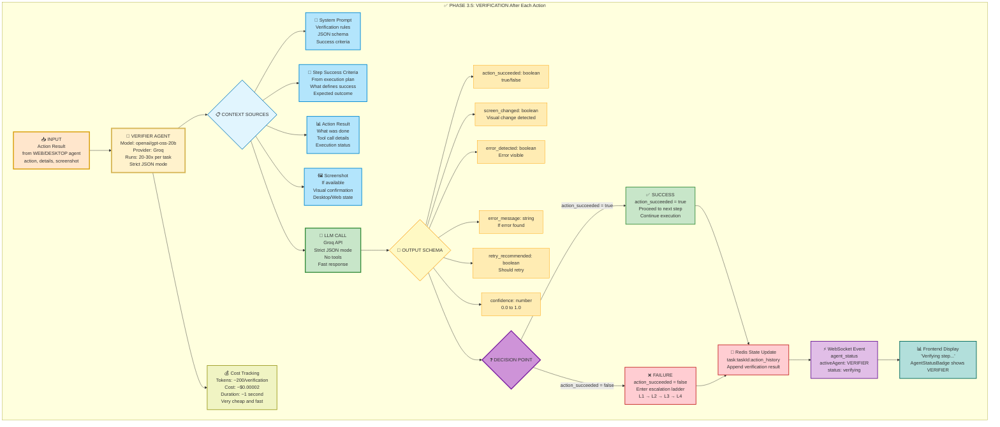

**VERIFIER Output Example:**

**Success:**
```json
{
  "action_succeeded": true,
  "screen_changed": true,
  "error_detected": false,
  "retry_recommended": false,
  "confidence": 0.95
}
```

**Failure:**
```json
{
  "action_succeeded": false,
  "screen_changed": false,
  "error_detected": true,
  "error_message": "Button not found on page",
  "retry_recommended": true,
  "confidence": 0.85
}
```

---

## Diagram 9: Escalation Strategy (Failure Recovery)

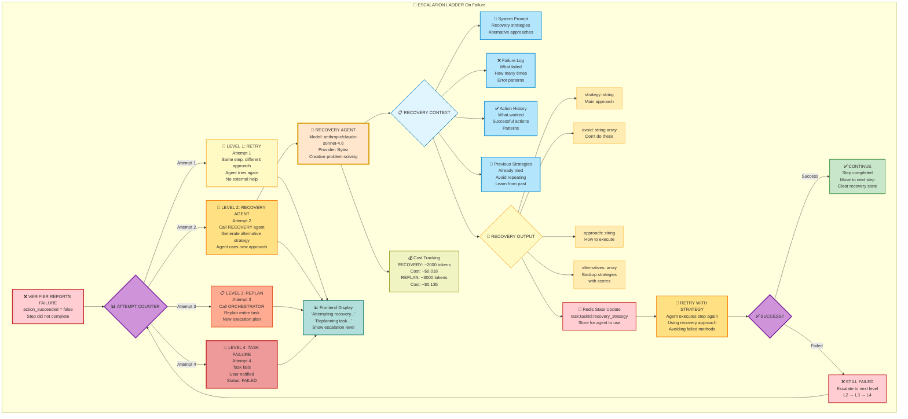

**RECOVERY AGENT Output Example:**

```json
{
  "strategy": "Use keyboard shortcut instead of clicking button",
  "avoid": [
    "Clicking the same button again",
    "Waiting for button to appear"
  ],
  "approach": "Press Ctrl+Enter to submit form instead of clicking Send button",
  "alternatives": [
    {
      "strategy": "Use terminal command to send email",
      "score": 0.7,
      "reasoning": "Bypass UI entirely, use command-line email client"
    },
    {
      "strategy": "Try different browser",
      "score": 0.5,
      "reasoning": "Current browser may have compatibility issues"
    }
  ]
}
```

---

## Diagram 10: Phase 4 - REPORTER Agent

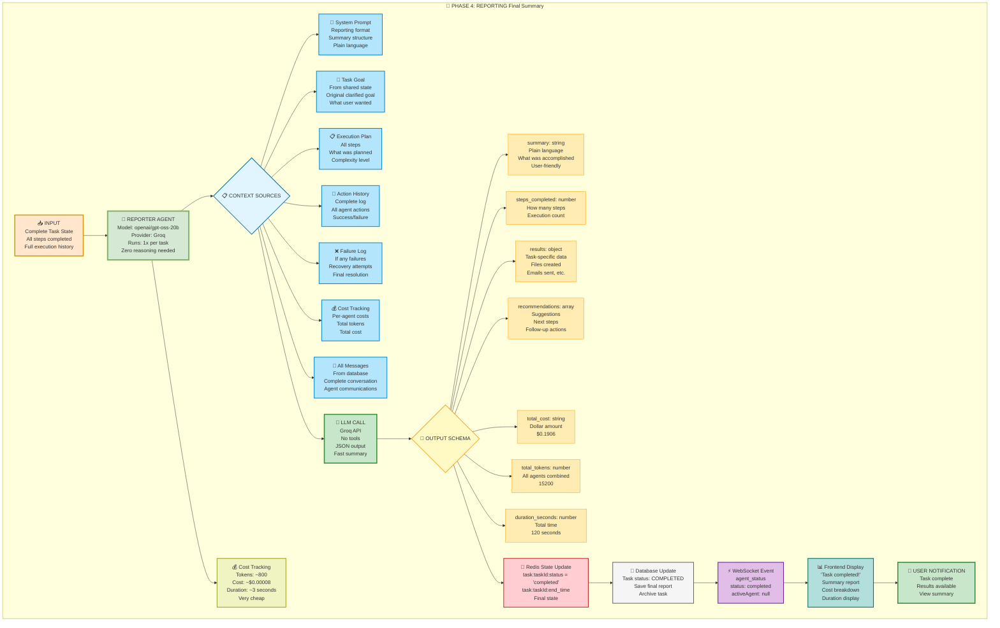

**REPORTER Output Example:**

```json
{
  "summary": "Task completed successfully! I searched Google for Python courses, saved the top 3 results to a file on your desktop (python_courses.txt), and emailed the file to you at user@example.com.",
  "steps_completed": 5,
  "results": {
    "search_query": "Python courses",
    "results_found": 10,
    "top_3_saved": [
      "Learn Python - Codecademy",
      "Python Tutorial - W3Schools",
      "Python for Beginners - Coursera"
    ],
    "file_created": "~/Desktop/python_courses.txt",
    "email_sent_to": "user@example.com",
    "email_subject": "Python Courses - Top 3 Results"
  },
  "recommendations": [
    "The file python_courses.txt is saved on your desktop for future reference",
    "Check your email inbox for the attachment"
  ],
  "total_cost": "$0.1906",
  "total_tokens": 15200,
  "duration_seconds": 120
}
```

---

## Diagram 11: Complete Mixed Workflow Example

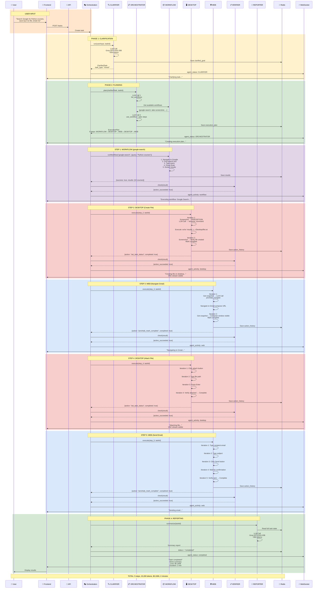

**Flow Summary:**
1. User input → CLARIFIER (1x)
2. CLARIFIER → ORCHESTRATOR (1x, discovers workflows)
3. ORCHESTRATOR creates mixed plan: WORKFLOW → DESKTOP → WEB → DESKTOP → WEB
4. Execute each step sequentially with VERIFIER after each
5. REPORTER generates final summary
6. Frontend displays real-time updates via WebSocket

---

## Diagram 12: Shared State & Context Flow

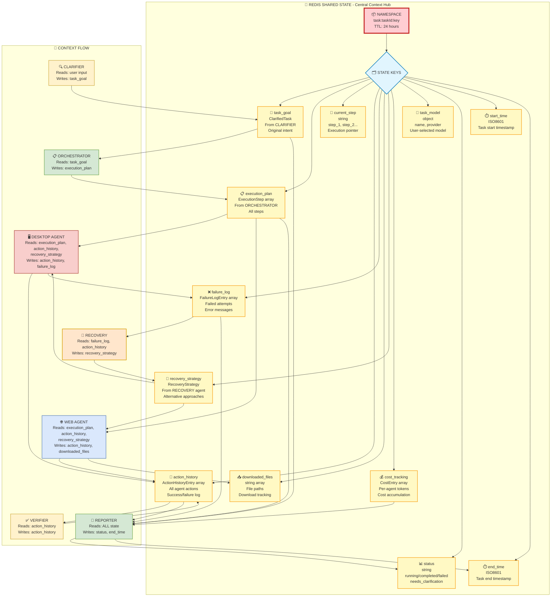

**Redis State Example:**

```json
{
  "task:abc123:task_goal": {
    "clarified_goal": "Search Google for Python courses...",
    "task_type": "mixed"
  },
  "task:abc123:execution_plan": {
    "steps": [
      {"id": "step_1", "type": "workflow", ...},
      {"id": "step_2", "type": "desktop", ...}
    ]
  },
  "task:abc123:current_step": "step_2",
  "task:abc123:action_history": [
    {"agent": "WORKFLOW", "action": "google-search", "result": "success"},
    {"agent": "DESKTOP", "action": "create_file", "result": "success"}
  ],
  "task:abc123:failure_log": [],
  "task:abc123:cost_tracking": [
    {"agent": "CLARIFIER", "tokens": 500, "cost": 0.00005},
    {"agent": "ORCHESTRATOR", "tokens": 3000, "cost": 0.135}
  ],
  "task:abc123:status": "running",
  "task:abc123:start_time": "2026-03-16T10:00:00Z"
}
```

---

## Diagram 13: WebSocket Real-Time Communication

```mermaid
sequenceDiagram
    participant UI as 📱 Frontend<br/>React Components
    participant WS as 🔌 WebSocket Client<br/>Socket.IO
    participant GW as ⚡ TasksGateway<br/>NestJS WebSocket
    participant OS as 🎭 OrchestrationService<br/>Agent Pipeline
    participant EE as 📡 EventEmitter2<br/>Internal Events
    
    rect rgb(230, 242, 255)
    Note over UI,WS: CONNECTION PHASE
    UI->>WS: Initialize Socket.IO<br/>Connect to backend
    WS->>GW: connect event
    GW-->>WS: Connection established
    UI->>WS: joinTask(taskId)
    WS->>GW: join_task event
    GW->>GW: client.join(`task_${taskId}`)
    GW-->>WS: Joined room
    end
    
    rect rgb(255, 242, 204)
    Note over OS,EE: AGENT EXECUTION
    OS->>EE: emit('task.status', {<br/>taskId, status: 'clarifying',<br/>activeAgent: 'CLARIFIER'})
    EE->>GW: @OnEvent('task.status')
    GW->>WS: agent_status event<br/>to room: task_${taskId}
    WS->>UI: Update AgentStatusBadge<br/>"Clarifying..."
    end
    
    rect rgb(213, 232, 212)
    Note over OS,UI: AGENT HANDOFF
    OS->>EE: emit('task.status', {<br/>status: 'planning',<br/>activeAgent: 'ORCHESTRATOR'})
    EE->>GW: @OnEvent('task.status')
    GW->>WS: agent_status event
    WS->>UI: Show AgentHandoffNotification<br/>"Handing off to Orchestrator"<br/>Auto-hide after 3s
    end
    
    rect rgb(248, 206, 204)
    Note over OS,UI: AGENT ACTIVITY
    OS->>EE: emit('browser.log', {<br/>taskId, type: 'tool.call',<br/>data: {name: 'computer', input: {...}}})
    EE->>GW: @OnEvent('browser.log')
    GW->>WS: browser_log event
    WS->>UI: Update activity feed<br/>Show tool execution
    
    OS->>GW: emitAgentActivity(taskId, {<br/>type: 'screenshot',<br/>data: base64Image})
    GW->>WS: agent_activity event
    WS->>UI: Display screenshot<br/>in activity feed
    end
    
    rect rgb(218, 232, 252)
    Note over OS,UI: TASK UPDATES
    OS->>GW: emitTaskUpdate(taskId, task)
    GW->>WS: task_updated event
    WS->>UI: Update task status<br/>Refresh task details
    
    OS->>GW: emitNewMessage(taskId, message)
    GW->>WS: new_message event
    WS->>UI: Add message to chat<br/>Show agent action
    end
    
    rect rgb(213, 232, 212)
    Note over OS,UI: TASK COMPLETION
    OS->>EE: emit('task.status', {<br/>status: 'completed',<br/>activeAgent: null})
    EE->>GW: @OnEvent('task.status')
    GW->>WS: agent_status event
    WS->>UI: Show "Task completed!"<br/>Display summary<br/>Hide AgentStatusBadge
    end
    
    rect rgb(255, 230, 230)
    Note over UI,GW: DISCONNECTION
    UI->>WS: leaveTask()
    WS->>GW: leave_task event
    GW->>GW: client.leave(`task_${taskId}`)
    UI->>WS: disconnect()
    WS->>GW: disconnect event
    end
    
    style UI fill:#E1F5FE,stroke:#0277BD,stroke-width:2px
    style WS fill:#B3E5FC,stroke:#0288D1,stroke-width:2px
    style GW fill:#E1BEE7,stroke:#6A1B9A,stroke-width:3px
    style OS fill:#E1D5E7,stroke:#9673A6,stroke-width:2px
    style EE fill:#FFE082,stroke:#F57C00,stroke-width:2px
```

**WebSocket Events:**

**Client → Server:**
```typescript
socket.emit('join_task', taskId)
socket.emit('leave_task', taskId)
```

**Server → Client (Room: `task_{taskId}`):**
```typescript
// Agent status updates
socket.on('agent_status', {
  status: 'clarifying' | 'planning' | 'executing' | 'verifying' | 'completed',
  activeAgent: 'CLARIFIER' | 'ORCHESTRATOR' | 'WEB' | 'DESKTOP' | null,
  timestamp: ISO8601
})

// Task updates
socket.on('task_updated', task)

// New messages
socket.on('new_message', message)

// Agent activity (screenshots, actions)
socket.on('agent_activity', {
  type: 'screenshot' | 'action' | 'reasoning' | 'perception',
  data: any,
  timestamp: ISO8601
})

// Browser logs (detailed execution)
socket.on('browser_log', {
  taskId: string,
  type: 'agent.start' | 'agent.response' | 'tool.call' | 'tool.result',
  timestamp: ISO8601,
  data: any
})
```

**Global Events (All Clients):**
```typescript
socket.on('task_created', task)
socket.on('task_deleted', taskId)
```

---

## Diagram 14: Cost & Token Tracking

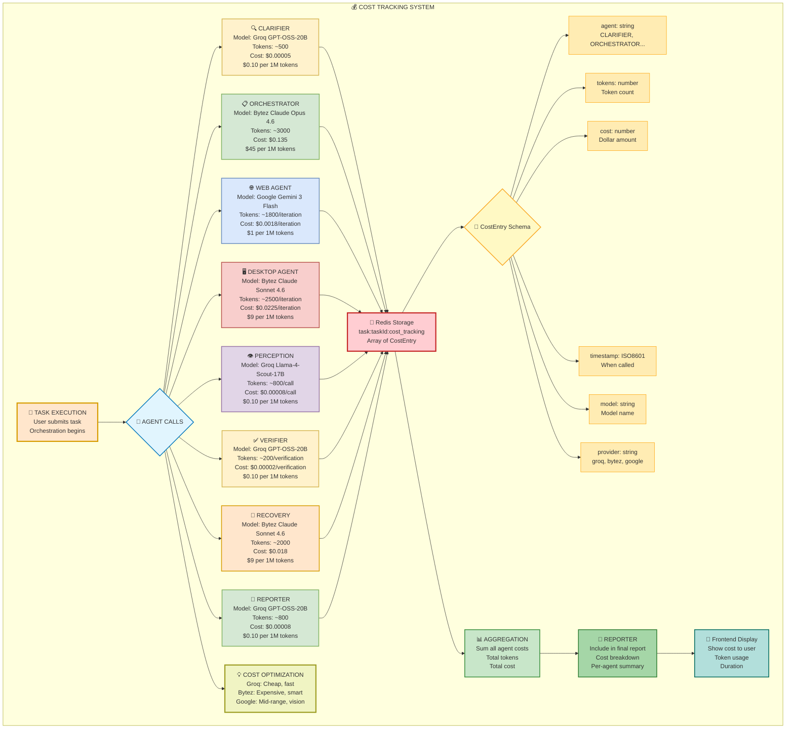

**Example Cost Breakdown:**

```json
{
  "cost_tracking": [
    {
      "agent": "CLARIFIER",
      "tokens": 500,
      "cost": 0.00005,
      "timestamp": "2026-03-16T10:00:00Z",
      "model": "openai/gpt-oss-20b",
      "provider": "groq"
    },
    {
      "agent": "ORCHESTRATOR",
      "tokens": 3000,
      "cost": 0.135,
      "timestamp": "2026-03-16T10:00:15Z",
      "model": "anthropic/claude-opus-4-6",
      "provider": "bytez"
    },
    {
      "agent": "DESKTOP",
      "tokens": 5700,
      "cost": 0.0513,
      "timestamp": "2026-03-16T10:01:00Z",
      "model": "anthropic/claude-sonnet-4-6",
      "provider": "bytez"
    },
    {
      "agent": "WEB",
      "tokens": 4000,
      "cost": 0.004,
      "timestamp": "2026-03-16T10:01:30Z",
      "model": "gemini-3-flash-preview",
      "provider": "google"
    },
    {
      "agent": "VERIFIER",
      "tokens": 2000,
      "cost": 0.0002,
      "timestamp": "2026-03-16T10:02:00Z",
      "model": "openai/gpt-oss-20b",
      "provider": "groq"
    },
    {
      "agent": "REPORTER",
      "tokens": 800,
      "cost": 0.00008,
      "timestamp": "2026-03-16T10:02:15Z",
      "model": "openai/gpt-oss-20b",
      "provider": "groq"
    }
  ],
  "total_tokens": 15200,
  "total_cost": 0.1906,
  "duration_seconds": 135
}
```

**Cost Optimization Strategy:**
- **Groq** (Cheap): CLARIFIER, VERIFIER, REPORTER, PERCEPTION - High-frequency, low-complexity
- **Bytez** (Expensive): ORCHESTRATOR, DESKTOP, RECOVERY - Low-frequency, high-complexity
- **Google** (Mid-range): WEB - Medium-frequency, vision capabilities

---

## Summary

These 14 diagrams provide complete visual documentation of the ARIA multi-agent system:

1. **High-Level Overview** - System architecture
2. **Frontend to Backend** - Request flow
3. **CLARIFIER** - Phase 1 details
4. **ORCHESTRATOR** - Phase 2 planning
5. **DESKTOP AGENT** - OS-level execution
6. **WEB AGENT** - Browser automation
7. **WORKFLOW** - Pre-built automation
8. **VERIFIER** - Success validation
9. **ESCALATION** - Failure recovery
10. **REPORTER** - Final summary
11. **Complete Example** - Mixed workflow scenario
12. **Shared State** - Redis context flow
13. **WebSocket** - Real-time communication
14. **Cost Tracking** - Token and cost management

**Copy any diagram code and paste into [mermaid.live](https://mermaid.live) to visualize!**

---

**END OF MERMAID DIAGRAMS**
