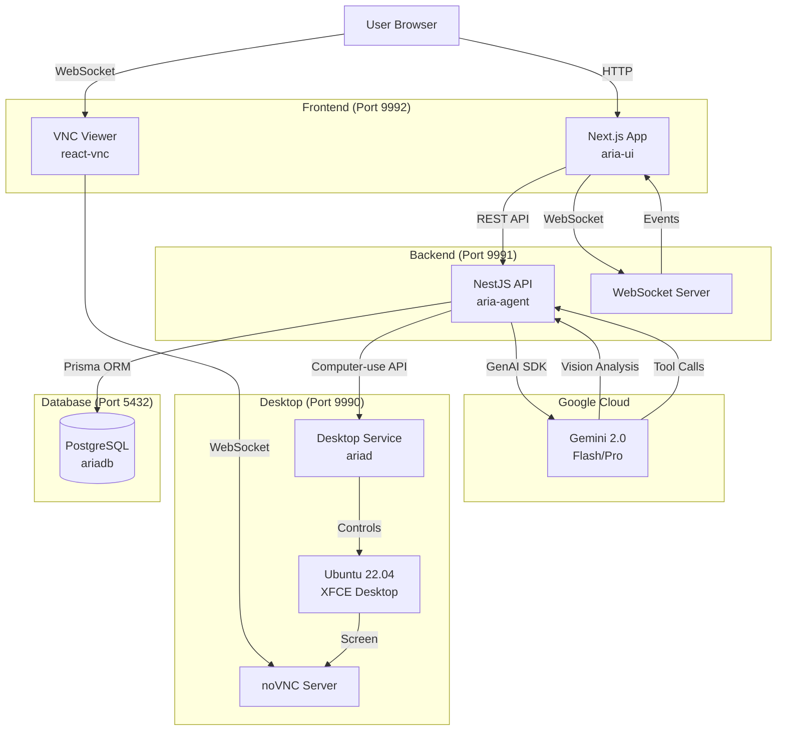
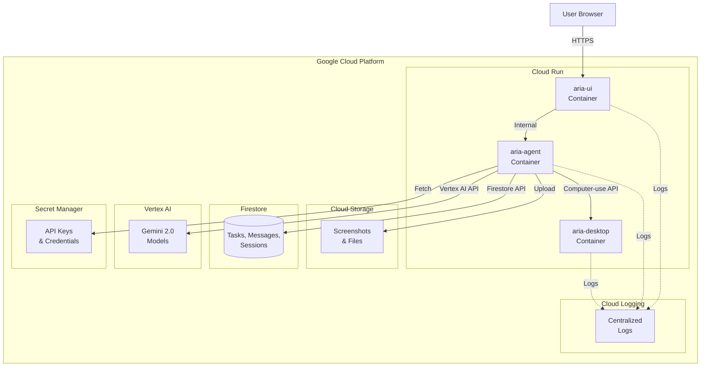

## High-Level Overview

Aria is a multi-tier application where users interact with a Next.js frontend, which communicates with a NestJS backend that orchestrates AI interactions via Google Gemini 2.0 and controls a virtual Ubuntu desktop environment. All data is persisted in PostgreSQL, and real-time updates flow through WebSocket connections.

## Monorepo Structure

```
Aria/
├── packages/
│   ├── aria-agent/              # Backend (NestJS)
│   │   ├── src/
│   │   │   ├── main.ts          # Entry point
│   │   │   ├── tasks/           # Task management
│   │   │   ├── messages/        # Message handling
│   │   │   ├── computer-use/    # Desktop control tools
│   │   │   ├── gemini/          # Gemini AI integration
│   │   │   └── firebase/        # Firebase services
│   │   ├── prisma/              # Database schema & migrations
│   │   └── package.json
│   │
│   ├── aria-ui/                 # Frontend (Next.js)
│   │   ├── src/
│   │   │   ├── app/             # Next.js pages
│   │   │   ├── components/      # React components
│   │   │   └── lib/             # Utilities
│   │   ├── server.ts            # Custom Express server
│   │   └── package.json
│   │
│   ├── ariad/                   # Desktop service
│   │   ├── src/
│   │   │   ├── computer-use/    # Desktop control API
│   │   │   └── vnc/             # VNC server integration
│   │   └── package.json
│   │
│   └── shared/                  # Shared types & utilities
│       ├── src/
│       │   ├── types/           # TypeScript types
│       │   └── utils/           # Common utilities
│       └── package.json
│
├── docker/
│   ├── docker-compose.yml              # PostgreSQL
│   ├── docker-compose.core.yml         # Desktop + DB
│   ├── docker-compose.development.yml  # Full stack
│   └── aria-desktop.Dockerfile         # Desktop image
│
├── docs/                        # Documentation (Mintlify)
├── STARTUP_GUIDE.md            # Quick start guide
├── QUICKSTART.md               # Detailed setup
└── HACKATHON_COMPLIANCE_REPORT.md  # Hackathon requirements
```

## Service Communication

### User → Frontend (aria-ui)

- User accesses http://localhost:9992
- Next.js serves the React application
- User creates tasks, views desktop, manages sessions

### Frontend → Backend (aria-agent)

- **REST API**: HTTP requests for CRUD operations (tasks, messages)
- **WebSocket**: Real-time updates (task status, new messages)
- **Proxy**: Custom Express server proxies API requests

### Backend → Gemini AI

- **Google GenAI SDK**: `@google/genai` v1.8.0
- **Models**: Gemini 2.5 Flash-Lite (default), 2.5 Flash, 2.5 Pro
- **Capabilities**:
  - Text generation
  - Vision (screenshot analysis)
  - Function calling (tool use)
  - Extended thinking (24,576 tokens)

### Backend → Desktop (ariad)

- **REST API**: HTTP requests to http://localhost:9990
- **Computer-use tools**:
  - `screenshot`: Capture desktop image
  - `click_mouse`: Click at coordinates
  - `type_text`: Keyboard input
  - `key_press`: Special keys (Enter, Tab, etc.)
  - `move_mouse`: Move cursor
  - `scroll`: Scroll up/down
  - `open_app`: Launch applications
  - `file_operations`: Read/write files

### Backend → Database (PostgreSQL)

- **Prisma ORM**: Type-safe database client
- **Connection**: postgresql://localhost:5432/ariadb
- **Models**: Tasks, Messages, Sessions, Users

### Frontend → Desktop (VNC)

- **WebSocket**: ws://localhost:9990/websockify
- **react-vnc**: React component for VNC viewing
- **Real-time**: Live desktop streaming in browser

## Architecture Diagram



## Data Flow: Task Execution

1. **User creates task**
   - User enters task description in UI
   - Frontend sends POST /tasks to backend
   - Backend creates task record in database

2. **Backend processes task**
   - Backend sends task to Gemini with system prompt
   - Gemini analyzes task and creates execution plan
   - Gemini may request tool calls (screenshot, click, type, etc.)

3. **Desktop interaction**
   - Backend calls ariad API with tool parameters
   - ariad executes action on Ubuntu desktop
   - ariad returns result (screenshot, success/failure)

4. **AI iteration**
   - Backend sends tool result back to Gemini
   - Gemini analyzes result (vision on screenshots)
   - Gemini decides next action or completes task
   - Loop continues until task is done

5. **Real-time updates**
   - Backend emits WebSocket events on each step
   - Frontend receives events and updates UI
   - User sees live progress and desktop changes

6. **Task completion**
   - Gemini marks task as complete
   - Backend updates task status in database
   - Frontend shows completion message

## Technology Stack Summary

| Layer | Technology | Purpose |
|-------|-----------|---------|
| **Frontend** | Next.js 15, React 19 | Web UI |
| **Backend** | NestJS 11, Node.js 20 | API server |
| **AI** | Google Gemini 2.0 | Task understanding & execution |
| **Desktop** | Ubuntu 22.04, XFCE | Virtual environment |
| **VNC** | noVNC, WebSocket | Desktop streaming |
| **Database** | PostgreSQL 15 | Data persistence |
| **ORM** | Prisma | Database client |
| **Real-time** | Socket.io | WebSocket communication |
| **Containerization** | Docker, Docker Compose | Service orchestration |
| **Language** | TypeScript | Type safety |

## Deployment Architecture (Planned)

For Google Cloud deployment:



## Security Considerations

- **API Keys**: Store in environment variables, never commit to git
- **Database**: Use strong passwords, restrict network access
- **Desktop**: Isolated container, no direct internet access from tasks
- **CORS**: Configure allowed origins for API
- **Authentication**: Firebase Auth integration (planned)
- **Rate Limiting**: Implement to prevent abuse
- **Input Validation**: Sanitize all user inputs

## Scalability Considerations

- **Horizontal Scaling**: Multiple backend instances behind load balancer
- **Desktop Pooling**: Pre-warmed desktop containers for faster task execution
- **Database**: Connection pooling, read replicas
- **Caching**: Redis for session data and frequent queries
- **CDN**: Static assets served from CDN
- **Async Processing**: Queue system for long-running tasks

> ⚠️ TODO: Implement and document production deployment architecture
